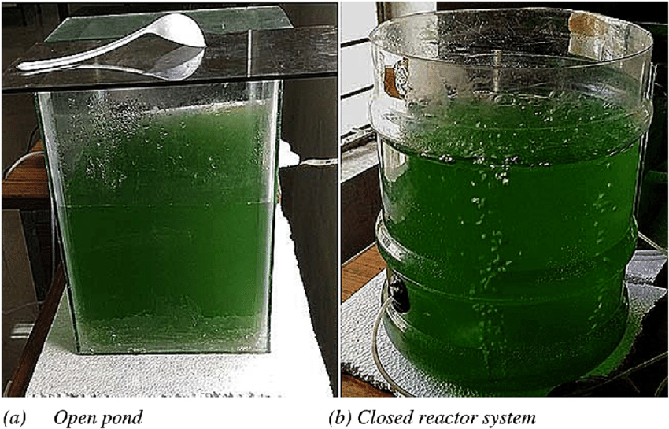
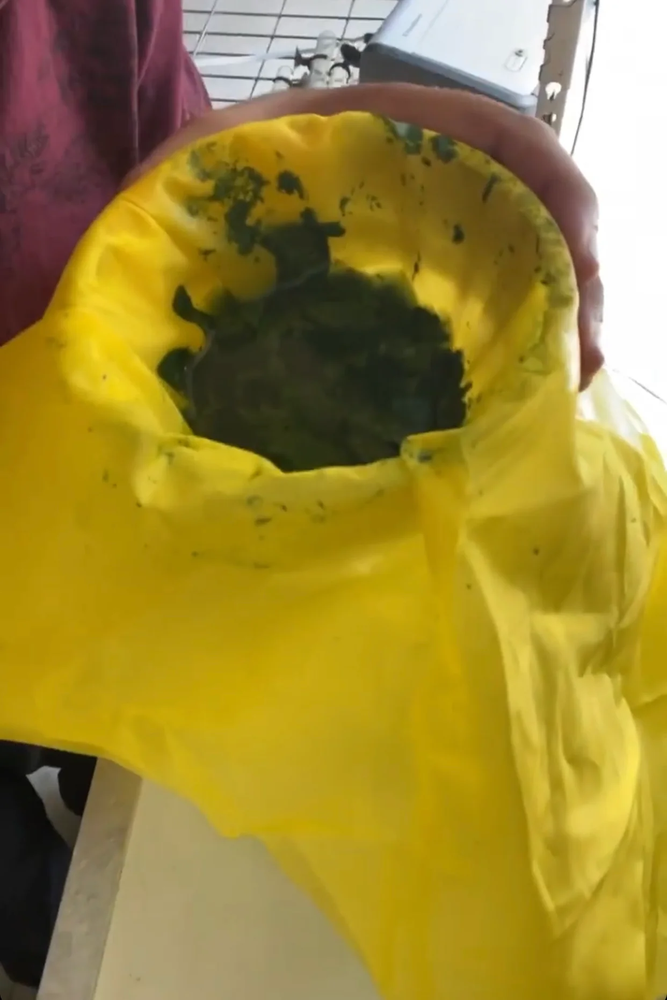
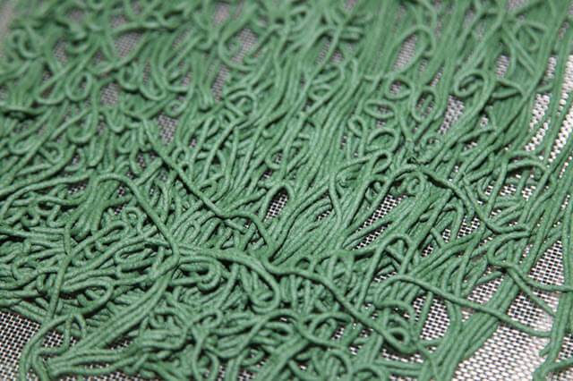

# Protocol for Growing Spirulina

## Materials Needed
**Water-tight, non-toxic container** (e.g., UV-resistant plastic film, concrete pond)  
**Clean water or filtered potable water**  
**Chemicals for culture medium:**  
- **Sodium carbonate (soda ash)**  
- **Sodium chloride (crude)**  
- **Potassium nitrate**  
- **Sodium bicarbonate**  
- **Potassium sulfate (crystallized)**  
- **Urea**  
- **Monoammonium phosphate (crystallized)**  
- **Magnesium sulfate (crystallized, MgSO4·7H2O)**  
- **Lime**  
- **Ferrous sulfate (crystallized, FeSO4·7H2O)**  
**Equipment for agitation** (e.g., broom, aquarium pumps)  
**Filtering cloth** (synthetic fiber, mesh size 30-50 microns)  
**Press for dewatering**  

## Climatic Factors
*Optimum growth temperature:* **35°C**  
*Growth ceases below 20°C and above 38°C*  
*Light:* **30% of full sunlight is ideal; avoid prolonged strong illumination**  
*Agitate culture to prevent prolonged exposure to full sunlight*  

## Culture Medium Preparation
**Example composition:**  
- **Sodium carbonate:** 5 g/L  
- **Sodium chloride:** 5 g/L  
- **Potassium nitrate:** 2 g/L  
- **Sodium bicarbonate:** 1 g/L  
- **Potassium sulfate:** 1 g/L  
- **Urea:** 0.02 g/L  
- **Monoammonium phosphate:** 0.1 g/L  
- **Magnesium sulfate:** 0.2 g/L  
- **Lime:** 0.02 g/L  
- **Ferrous sulfate:** 0.005 g/L  

## Seeding
Use a spirulina strain with high coiled filaments and high gamma-linolenic acid (GLA) content.  
Maintain culture at a concentration of 0.3 g/L after dilution.  

## Growing Conditions
Keep the culture depth between 10 and 20 cm.  
Maintain culture medium's pH around 10.4 by adding CO2 or bicarbonate as needed.  
Provide continuous or regular agitation.  

## Harvesting
1. **Filtration:**  
   - Use fine weave cloth (30-50 microns).  
   - Filter the culture using gravity.  
   - Support filtration cloth with a net to protect from rupturing.
2. **Dewatering:**  
   - Press biomass to remove residual culture medium.  
   - Use a strong cotton cloth and apply pressure with a heavy object for about 15 minutes.  

## Drying
- Extrude biomass into rods (1-2 mm diameter) and dry on a plastic perforated tray.
- Protect from contamination and limit drying temperature to 68°C for up to 7 hours.
- Final product should have less than 9% water content.

## Feeding the Culture
Add nutrients to maintain medium fertility:  
- **Urea:** 300 g/kg of harvested spirulina  
- **Monoammonium phosphate:** 50 g/kg  
- **Potassium sulfate:** 30 g/kg  
- **Magnesium sulfate:** 30 g/kg  
- **Lime:** 10 g/kg  
- **Iron sulfate:** 2.5 g/kg  
- **Micronutrients solution:** 5 ml/kg (optional)  

## Maintenance
- Regularly agitate the culture.
- Compensate for evaporation with clean water.
- Manage pH and salinity to avoid undesirable exopolysaccharide (EPS) production.
- Monitor for contaminants and renew culture medium as necessary.

## Culture Medium Composition
| **Component**                  | **Concentration (g/L)** |
|--------------------------------|-------------------------|
| Sodium carbonate (soda ash)    | 5.0                     |
| Sodium chloride                | 5.0                     |
| Potassium nitrate              | 2.0                     |
| Sodium bicarbonate             | 1.0                     |
| Potassium sulfate              | 1.0                     |
| Urea                           | 0.02                    |
| Monoammonium phosphate         | 0.1                     |
| Magnesium sulfate (MgSO4·7H2O) | 0.2                     |
| Lime                           | 0.02                    |
| Ferrous sulfate (FeSO4·7H2O)   | 0.005                   |

## Anions and Cations Composition
| **Ion**      | **Concentration (mg/L)** |
|--------------|---------------------------|
| Carbonate    | 2800                      |
| Bicarbonate  | 720                       |
| Nitrate      | 614                       |
| Phosphate    | 80                        |
| Sulfate      | 350                       |
| Chloride     | 3030                      |
| Sodium       | 4380                      |
| Potassium    | 642                       |
| Magnesium    | 10                        |
| Calcium      | 10                        |
| Iron         | 0.8                       |
| Urea         | < 50                      |

## Recommended Feed Formula
| **Nutrient**                   | **Amount per kg of harvested spirulina (dry product)** |
|--------------------------------|---------------------------------------------------------|
| Urea                           | 300 g                                                   |
| Monoammonium phosphate         | 50 g                                                    |
| Potassium sulfate              | 30 g (or 40 g if no potassium nitrate is used in culture)|
| Magnesium sulfate*             | 30 g                                                    |
| Lime                           | 10 g                                                    |
| Iron sulfate*                  | 2.5 g                                                   |
| Micronutrients solution**      | 5 ml     
*Use crystallized commercial product (e.g., MgSO4·7H2O).  
**Optional, supplied by Antenna Technology, Geneva.

## Photos

 
*Figure 1: Spirulina culture in a pond with optimal growth conditions.*

 
*Figure 2: Harvesting spirulina using fine weave cloth.*

 
*Figure 3: Extruded spirulina rods drying on a perforated tray.*

## Scientific References
- [Coral bleaching: the role of the host](https://www.sciencedirect.com/science/article/pii/S1874778715000454)
- [Effects of spirulina on the immune system](https://www.ncbi.nlm.nih.gov/pmc/articles/PMC3136577/)
- [Spirulina as a functional food: A review](https://www.sciencedirect.com/science/article/abs/pii/S0924224411002401)

## Online Protocol
- [Protocol for the transformation and engineering of edible algae Arthrospira platensis to generate heterologous protein-expressing strains](https://www.ncbi.nlm.nih.gov/pmc/articles/PMC9929480/)
