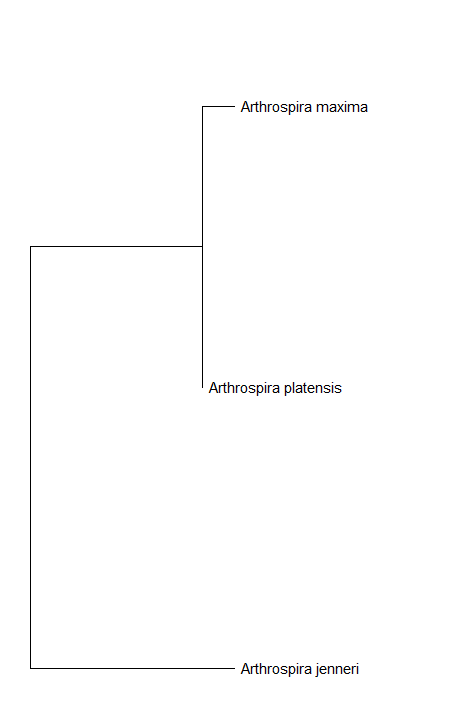

Phylogenetic tree in MEGA. A bootstrap consensus version tree was constructed.

Analysis of:
 Arthrospira platensis FACHB439 ribulose-1,5-bisphosphate carboxylase/oxygenase large subunit (rbcL) gene, partial cds

Arthrospira jenneri A10 ribulose-1,5-bisphosphate carboxylase/oxygenase large subunit (rbcL) gene, partial cds; chaperonin-like protein (rbcX) gene, complete cds; and ribulose-1,5-bisphosphate carboxylase/oxygenase small subunit (rbcS) gene, partial cds

Arthrospira maxima OUQDSM ribulose-1,5-bisphosphate carboxylase/oxygenase large subunit (rbcL) gene, partial cds

