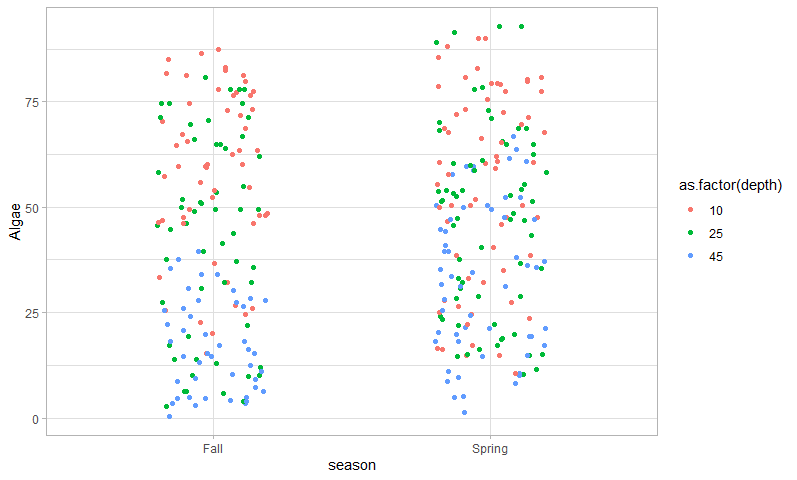
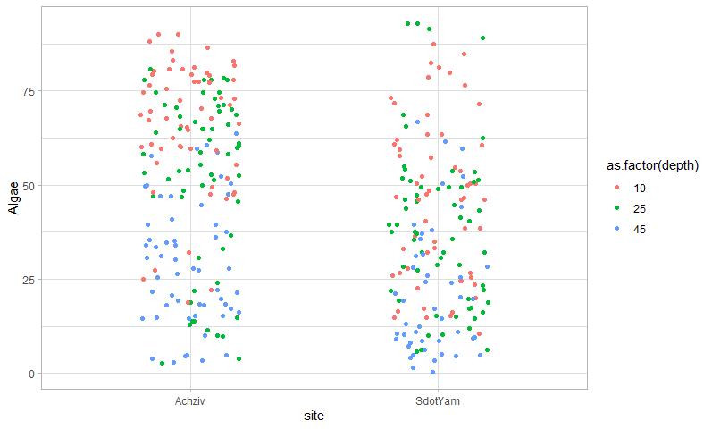
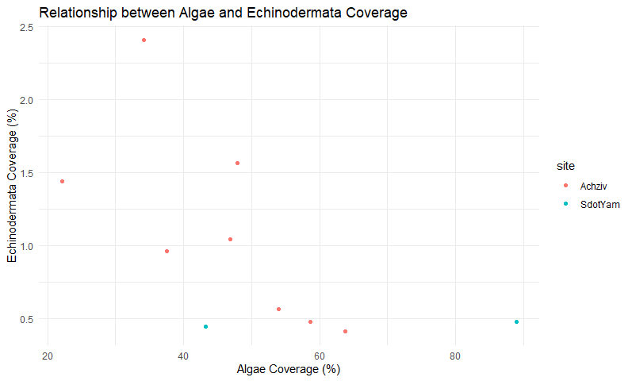
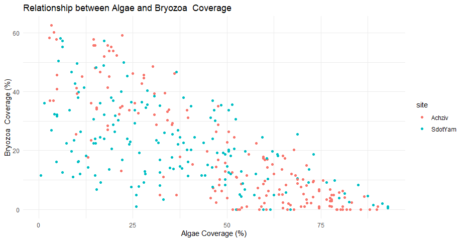

# The goal of this analysis is to investigate and comprehend how the presence of algae is influenced by seasons, depths, and years. The data was processed using R, and various statistical analyses were performed to determine the significance of these factors.

## Let's look at the presence of algae:

As we can see, there is more algae presence at 10 and 25 meters. This is understandable because algae depend on sunlight. We should also mention that algae have the highest representation and were found in all samples (the lowest was at 45 meters and was estimated as 0.48 - you can notice the small blue dot at the edge of the X vector). Also, we can notice that seasons don't affect algae much.

### Kruskal-Wallis Test

Kruskal-Wallis chi-squared = 87.592, df = 2, p-value < 2.2e-16

Since the p-value is far less than any commonly used significance level, this means there is extremely strong evidence to suggest that the distributions of algae presence are significantly different across the different depths. This indicates that depth has a significant effect on the presence of algae.

## For comparison, let's look at the representation of the lowest taxonomic group, Mollusca.

In comparison to algae, Mollusca have a very sparse presence, only in 4 measurements! This makes up 1.17% of total measurements. This also explains why we have so much algae, as many Mollusca species are herbivores, and their presence might reduce algae.

## Let's analyze the sites.

 
We can see clearly that in the Achziv site, the presence of algae is higher, especially at lower depths. Algae need a proper substrate to attach to, so Achziv might have better conditions for algae or less pressure from herbivores. Let's check this theory by comparing the presence of algae with echinodermata.

As we can see, there is some competition between these two taxonomic groups, but due to a lack of data, we can't be sure. Let's also check Bryozoa; maybe the competition for substrate is higher than the prey-predator connection.

And yes! We see a strong correlation between these two groups, let's do a Kruskal-Wallis Test.

### Kruskal-Wallis Test

Kruskal-Wallis chi-squared = 255.54, df = 170, p-value = 2.392e-05

Since the p-value is far less than any commonly used significance level, this means there is strong evidence to suggest that the distributions of algae presence are significantly different across the different levels of Bryozoa. This indicates that Bryozoa has a significant effect on the presence of algae.

## Conclusion

In conclusion, the analysis indicates that depth, site conditions, and the presence of other taxonomic groups significantly influence the distribution of algae. Depth plays a crucial role, with more algae presence at shallower depths due to the dependency on sunlight. The site-specific analysis suggests that environmental factors and the presence of herbivores like Mollusca and competitors like Bryozoa and Echinodermata affect algae distribution.

❤️Thanks for teaching us❤️ 

